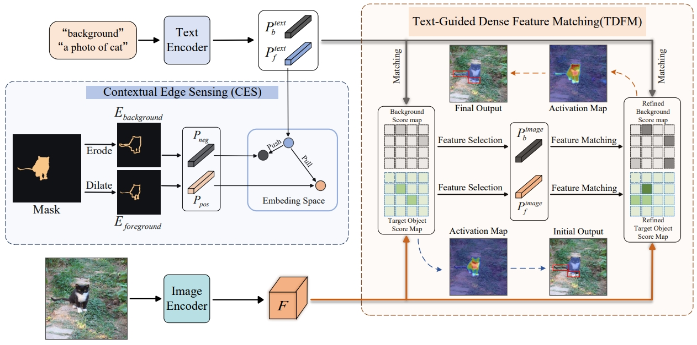

# EdgeCLIP: Injecting Edge-Awareness into Visual-Language Models for Zero-Shot Semantic Segmentation

📢Thanks for your interest in our work!

Jiaxiang Fang, Shiqiang Ma, Guihua Duan, Fei Guo, Shengfeng He

> **Abstract:** Effective segmentation of unseen categories in zero-shot semantic segmentation is hindered by models' limited ability to interpret edges in unfamiliar contexts. In this paper, we propose EdgeCLIP, which addresses this by integrating CLIP with explicit edge-awareness. Based on the premise that edge variation patterns are similar across both seen and unseen objects, EdgeCLIP introduces the Contextual Edge Sensing module. This module accurately discerns and utilizes edge information, which is crucial in complex border areas where conventional models struggle. Further, our Text-Guided Dense Feature Matching strategy precisely aligns text encodings with corresponding visual edge features, effectively distinguishing them from background edges. This strategy not only optimizes the training of CLIP's image and text encoders but also leverages the intrinsic completeness of objects, enhancing the model's ability to generalize and accurately segment objects in unseen classes. EdgeCLIP significantly outperforms the current state-of-the-art method, achieving a deep impressive margin of **5.8%** and **17.5%** on PASCAL-5i and COCO-20i datasets respectively.
   
## Installation

### 📘 Environment
   - python == 3.9.13

   - torch == 1.13.0

   - torchvision == 0.14.0 

   - cuda == 11.6

### 📝 Data preparation
Download the PASCAL-5i and COCO-20i datasets following  [HERE](https://github.com/juhongm999/hsnet).  

The ./datasets/ folder should have the following hierarchy:

    └── datasets/
        ├── VOC2012/            # PASCAL VOC2012 devkit
        │   ├── Annotations/
        │   ├── ImageSets/
        │   ├── ...
        │   ├── SegmentationClassAug/
        ├── COCO2014/           
        │   ├── annotations/
        │   │   ├── train2014/  # (dir.) training masks
        │   │   ├── val2014/    # (dir.) validation masks 
        │   │   └── ..some json files..
        │   ├── train2014/
        │   ├── val2014/
        

## 📚 References

This repository owes its existence to the exceptional contributions of other projects:

* DenseCLIP: https://github.com/raoyongming/DenseCLIP
* SAZS: https://github.com/Liuxinyv/SAZS?tab=readme-ov-file

Many thanks to their invaluable contributions.

